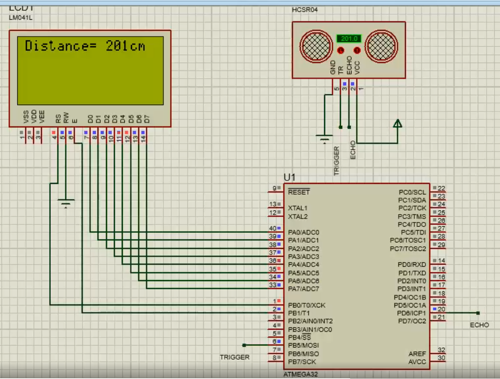

# 📏 Distance Measuring System - HC-SR04 & ATmega32

## 📖 Overview

This project implements a **distance measurement system** using the **HC-SR04 Ultrasonic Sensor** and **ATmega32 Microcontroller**.  
The measured distance is displayed on a **4x16 LCD**, providing a real-time, accurate reading of objects in centimeters.

The system is built with a **layered architecture**, including drivers for GPIO, ICU, LCD, and Ultrasonic Sensor, making it modular and easy to understand for embedded systems learners.

---

## ⚙️ Features

- **Ultrasonic Distance Measurement**:
  - Uses **HC-SR04 sensor** to measure distances in centimeters.

- **LCD Display**:
  - Shows the measured distance on a **4x16 LCD**.

- **ATmega32 Microcontroller**:
  - Runs at a **clock frequency of 8 MHz**.

- **Layered Architecture**:
  - Modular design with separate drivers for **GPIO, ICU, LCD, and Ultrasonic Sensor**.

---

## 🏗 System Architecture

The system is organized using a **layered driver-based approach**:

- **GPIO Driver**: Manages input/output pins for LCD and ultrasonic sensor.
- **ICU Driver**: Measures pulse duration from the HC-SR04 using the Input Capture Unit.
- **LCD Driver**: Controls communication and updates the 4x16 LCD display.
- **Ultrasonic Sensor Driver**: Triggers the sensor and processes echo signals to calculate distance.

---

## 🛠 How It Works

1. The **HC-SR04 sensor** is triggered by sending a pulse to the Trigger Pin.
2. The sensor emits a sound pulse and waits for the echo to return.
3. The **ICU** measures the time taken for the echo to return.
4. The time is converted to **distance in centimeters**.
5. The measured distance is displayed on the **4x16 LCD**.

---

## 🔧 Driver Functions

The **Ultrasonic Sensor Driver** includes:

- `Ultrasonic_init()` → Initializes the ICU and trigger pin.
- `Ultrasonic_Trigger()` → Sends a trigger pulse to the HC-SR04.
- `Ultrasonic_readDistance()` → Sends the trigger pulse and reads the distance.
- `Ultrasonic_edgeProcessing()` → Callback function for ICU to process echo and calculate pulse width.

---

## 📸 Screenshot

---

## 🎥 Simulation Video

Watch the simulation on LinkedIn:  
[Distance Measuring System Simulation Video](https://www.linkedin.com/posts/youssef-adel-a601641b1_embeddedsystems-atmega32-hal-activity-7121447025786667008-BNm0?utm_source=share&utm_medium=member_desktop&rcm=ACoAADFSougBbplLvCFvoq2oVcM3uoEe_eK2zig)

---

## 📁 Components & Requirements

- **ATmega32 Microcontroller**
- **HC-SR04 Ultrasonic Sensor**
- **4x16 LCD**
- **GPIO Pins**
- **ICU for pulse detection**
- **C programming language** for firmware
